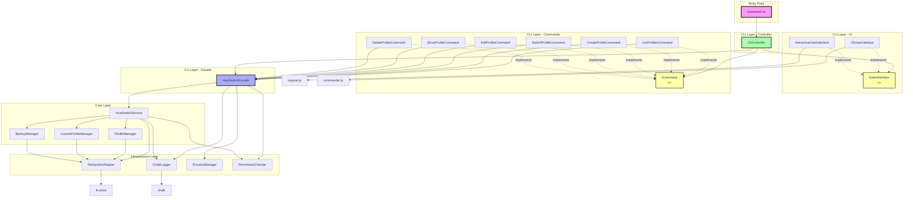
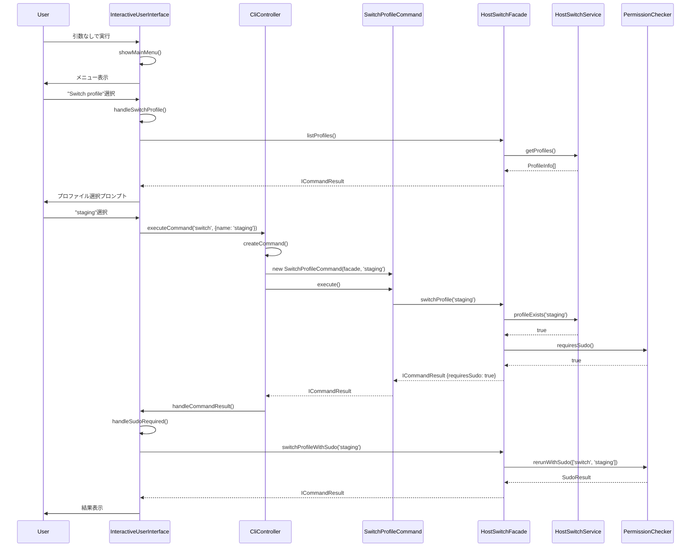

# HostSwitch アーキテクチャ図

## 現在のアーキテクチャ（実装済み）

## アーキテクチャの利点

### 1. 単一責任の原則（SRP）
- **CliController**: コマンドのディスパッチのみ担当
- **Command Classes**: 各コマンドの実行ロジックのみ担当
- **HostSwitchFacade**: ビジネス操作の統一インターフェースのみ提供
- **UI Classes**: ユーザーインタラクションのみ担当

### 2. 開放/閉鎖の原則（OCP）
- 新しいコマンドの追加が既存コードを変更せずに可能
- ICommandインターフェースを実装するだけで新機能追加可能

### 3. 依存性逆転の原則（DIP）
- 上位モジュールは下位モジュールに依存せず、抽象に依存
- IUserInterface、ICommand等のインターフェースを通じた疎結合

### 4. インターフェース分離の原則（ISP）
- 小さく特化したインターフェース（ICommand、IUserInterface）
- クライアントは必要なメソッドのみに依存

### 5. テスタビリティの向上
- 各コンポーネントが独立してテスト可能
- モックを使用した単体テストが容易
- 依存性注入によるテストの柔軟性

## データフロー図

## クラス構造図

## 実装状況

### ✅ 完了したフェーズ

1. **Phase 1: 基盤**
   - ICommandResultインターフェース定義 ✅
   - HostSwitchFacade実装 ✅
   - Facadeテスト ✅

2. **Phase 2: Command Pattern**
   - ICommandインターフェース定義 ✅
   - 各Commandクラス実装 ✅
   - Commandテスト ✅

3. **Phase 3: UI抽象化**
   - IUserInterfaceインターフェース定義 ✅
   - InteractiveUserInterface実装 ✅
   - CliUserInterface実装 ✅
   - UIテスト ✅

4. **Phase 4: 統合**
   - CliController実装 ✅
   - hostswitch.ts更新 ✅
   - 統合テスト ✅

5. **Phase 5: クリーンアップ**
   - 旧InteractiveMode削除 ✅
   - 旧CommandHandler削除 ✅
   - ドキュメント更新 ✅

### 🎉 アーキテクチャリファクタリング完了

すべてのフェーズが正常に完了し、クリーンアーキテクチャへの移行が成功しました。