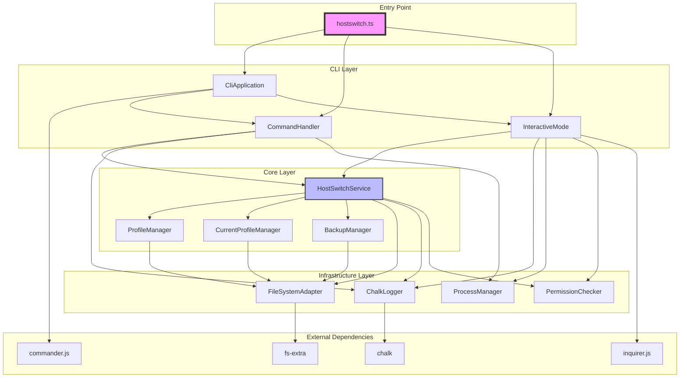
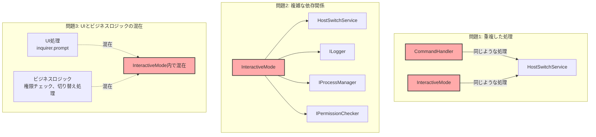
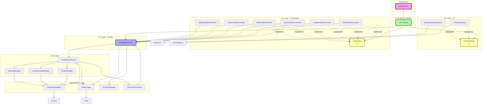
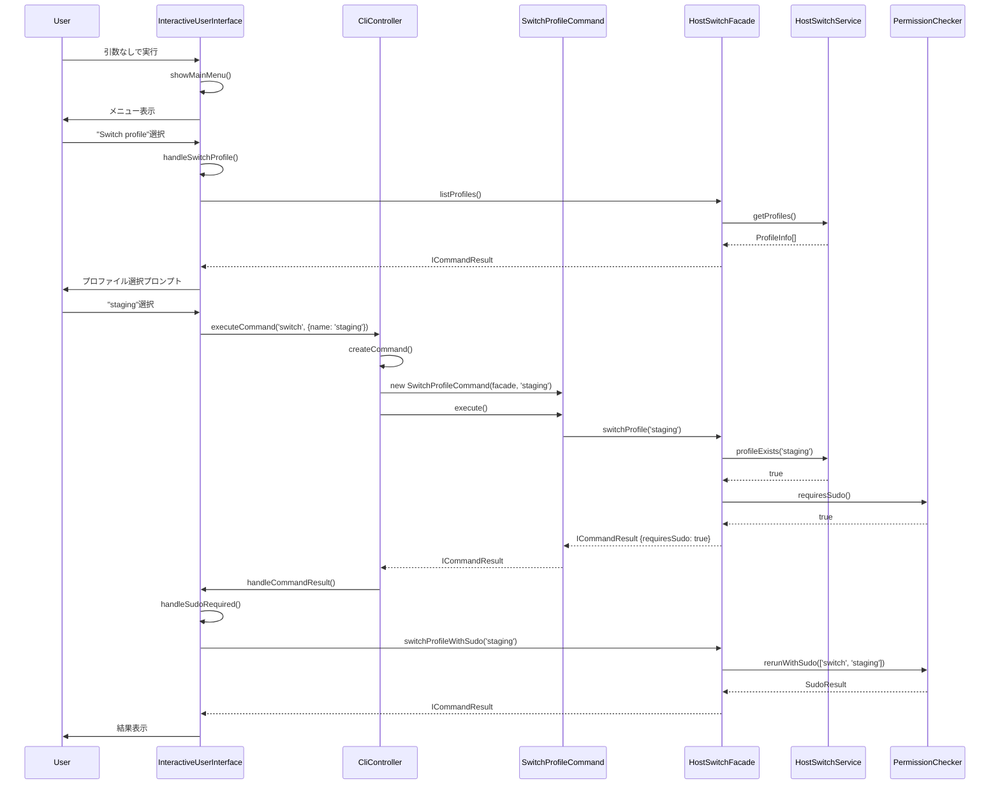
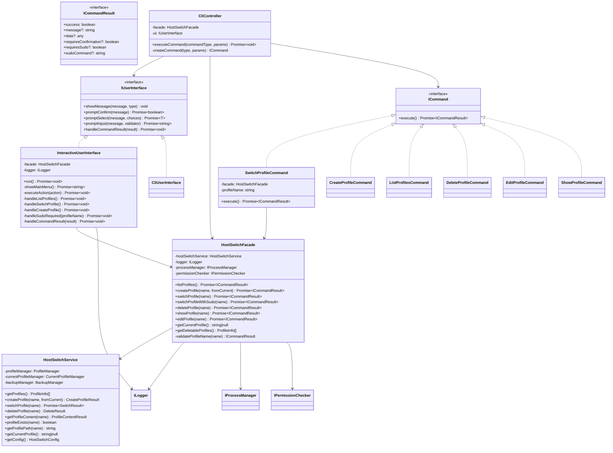

# HostSwitch アーキテクチャ図

## 現在のアーキテクチャ

```mermaid
graph TB
    subgraph "Entry Point"
        A[hostswitch.ts]
    end
    
    subgraph "CLI Layer"
        B[CliApplication]
        C[CommandHandler]
        D[InteractiveMode]
    end
    
    subgraph "Core Layer"
        E[HostSwitchService]
        F[ProfileManager]
        G[CurrentProfileManager]
        H[BackupManager]
    end
    
    subgraph "Infrastructure Layer"
        I[FileSystemAdapter]
        J[ChalkLogger]
        K[ProcessManager]
        L[PermissionChecker]
    end
    
    subgraph "External Dependencies"
        M[commander.js]
        N[inquirer.js]
        O[fs-extra]
        P[chalk]
    end
    
    %% Entry Point connections
    A --> B
    A --> C
    A --> D
    
    %% CLI Layer connections
    B --> M
    B --> C
    B --> D
    C --> E
    C --> J
    C --> K
    D --> E
    D --> J
    D --> K
    D --> L
    D --> N
    
    %% Core Layer connections
    E --> F
    E --> G
    E --> H
    E --> I
    E --> J
    E --> L
    
    F --> I
    G --> I
    H --> I
    
    %% Infrastructure connections
    I --> O
    J --> P
    
    style A fill:#f9f,stroke:#333,stroke-width:4px
    style E fill:#bbf,stroke:#333,stroke-width:2px
```

## 問題点の可視化

```mermaid
graph TB
    subgraph "問題1: 重複した処理"
        CH[CommandHandler]
        IM[InteractiveMode]
        HSS1[HostSwitchService]
        
        CH -->|同じような処理| HSS1
        IM -->|同じような処理| HSS1
    end
    
    subgraph "問題2: 複雑な依存関係"
        IM2[InteractiveMode]
        D1[HostSwitchService]
        D2[ILogger]
        D3[IProcessManager]
        D4[IPermissionChecker]
        
        IM2 --> D1
        IM2 --> D2
        IM2 --> D3
        IM2 --> D4
    end
    
    subgraph "問題3: UIとビジネスロジックの混在"
        UI[UI処理<br/>inquirer.prompt]
        BL[ビジネスロジック<br/>権限チェック、切り替え処理]
        IM3[InteractiveMode内で混在]
        
        UI -.->|混在| IM3
        BL -.->|混在| IM3
    end
    
    style CH fill:#faa,stroke:#333,stroke-width:2px
    style IM fill:#faa,stroke:#333,stroke-width:2px
    style IM2 fill:#faa,stroke:#333,stroke-width:2px
    style IM3 fill:#faa,stroke:#333,stroke-width:2px
```

## 改善案のアーキテクチャ

```mermaid
graph TB
    subgraph "Entry Point"
        A[hostswitch.ts]
    end
    
    subgraph "CLI Layer - Controller"
        B[CliController]
    end
    
    subgraph "CLI Layer - UI"
        C[CliUserInterface]
        D[InteractiveUserInterface]
        E[IUserInterface<br/><<interface>>]
    end
    
    subgraph "CLI Layer - Commands"
        F[ICommand<br/><<interface>>]
        G[ListProfilesCommand]
        H[CreateProfileCommand]
        I[SwitchProfileCommand]
        J[EditProfileCommand]
        K[ShowProfileCommand]
        L[DeleteProfileCommand]
    end
    
    subgraph "CLI Layer - Facade"
        M[HostSwitchFacade]
    end
    
    subgraph "Core Layer"
        N[HostSwitchService]
        O[ProfileManager]
        P[CurrentProfileManager]
        Q[BackupManager]
    end
    
    subgraph "Infrastructure Layer"
        R[FileSystemAdapter]
        S[ChalkLogger]
        T[ProcessManager]
        U[PermissionChecker]
    end
    
    %% Entry Point
    A --> B
    
    %% Controller connections
    B --> E
    B --> F
    B --> M
    
    %% UI implementations
    C -.->|implements| E
    D -.->|implements| E
    D --> inquirer[inquirer.js]
    C --> commander[commander.js]
    
    %% Command implementations
    G -.->|implements| F
    H -.->|implements| F
    I -.->|implements| F
    J -.->|implements| F
    K -.->|implements| F
    L -.->|implements| F
    
    %% Commands use Facade
    G --> M
    H --> M
    I --> M
    J --> M
    K --> M
    L --> M
    
    %% Facade uses Core and Infrastructure
    M --> N
    M --> S
    M --> T
    M --> U
    
    %% Core Layer connections
    N --> O
    N --> P
    N --> Q
    N --> R
    N --> S
    N --> U
    
    O --> R
    P --> R
    Q --> R
    
    %% Infrastructure connections
    R --> fs[fs-extra]
    S --> chalk[chalk]
    
    style A fill:#f9f,stroke:#333,stroke-width:4px
    style M fill:#aaf,stroke:#333,stroke-width:3px
    style B fill:#afa,stroke:#333,stroke-width:3px
    style E fill:#ffa,stroke:#333,stroke-width:2px
    style F fill:#ffa,stroke:#333,stroke-width:2px
```

## データフロー図

```mermaid
sequenceDiagram
    participant User
    participant UI as InteractiveUserInterface
    participant Controller as CliController
    participant Command as SwitchProfileCommand
    participant Facade as HostSwitchFacade
    participant Service as HostSwitchService
    participant Permission as PermissionChecker
    
    User->>UI: 引数なしで実行
    UI->>UI: showMainMenu()
    UI->>User: メニュー表示
    User->>UI: "Switch profile"選択
    
    UI->>UI: handleSwitchProfile()
    UI->>Facade: listProfiles()
    Facade->>Service: getProfiles()
    Service-->>Facade: ProfileInfo[]
    Facade-->>UI: ICommandResult
    
    UI->>User: プロファイル選択プロンプト
    User->>UI: "staging"選択
    
    UI->>Controller: executeCommand('switch', {name: 'staging'})
    Controller->>Controller: createCommand()
    Controller->>Command: new SwitchProfileCommand(facade, 'staging')
    Controller->>Command: execute()
    
    Command->>Facade: switchProfile('staging')
    Facade->>Service: profileExists('staging')
    Service-->>Facade: true
    
    Facade->>Permission: requiresSudo()
    Permission-->>Facade: true
    
    Facade-->>Command: ICommandResult {requiresSudo: true}
    Command-->>Controller: ICommandResult
    Controller->>UI: handleCommandResult()
    
    UI->>UI: handleSudoRequired()
    UI->>Facade: switchProfileWithSudo('staging')
    Facade->>Permission: rerunWithSudo(['switch', 'staging'])
    Permission-->>Facade: SudoResult
    Facade-->>UI: ICommandResult
    
    UI->>User: 結果表示
```

## クラス構造図

```mermaid
classDiagram
    class ICommand {
        <<interface>>
        +execute() Promise~ICommandResult~
    }
    
    class ICommandResult {
        <<interface>>
        +success: boolean
        +message?: string
        +data?: any
        +requiresConfirmation?: boolean
        +requiresSudo?: boolean
        +sudoCommand?: string
    }
    
    class IUserInterface {
        <<interface>>
        +showMessage(message, type) void
        +promptConfirm(message) Promise~boolean~
        +promptSelect(message, choices) Promise~T~
        +promptInput(message, validator) Promise~string~
        +handleCommandResult(result) Promise~void~
    }
    
    class HostSwitchFacade {
        -hostSwitchService: HostSwitchService
        -logger: ILogger
        -processManager: IProcessManager
        -permissionChecker: IPermissionChecker
        +listProfiles() Promise~ICommandResult~
        +createProfile(name, fromCurrent) Promise~ICommandResult~
        +switchProfile(name) Promise~ICommandResult~
        +switchProfileWithSudo(name) Promise~ICommandResult~
        +deleteProfile(name) Promise~ICommandResult~
        +showProfile(name) Promise~ICommandResult~
        +editProfile(name) Promise~ICommandResult~
        +getCurrentProfile() string|null
        +getDeletableProfiles() ProfileInfo[]
        -validateProfileName(name) ICommandResult
    }
    
    class CliController {
        -facade: HostSwitchFacade
        -ui: IUserInterface
        +executeCommand(commandType, params) Promise~void~
        -createCommand(type, params) ICommand
    }
    
    class InteractiveUserInterface {
        -facade: HostSwitchFacade
        -logger: ILogger
        +run() Promise~void~
        -showMainMenu() Promise~string~
        -executeAction(action) Promise~void~
        -handleListProfiles() Promise~void~
        -handleSwitchProfile() Promise~void~
        -handleCreateProfile() Promise~void~
        -handleSudoRequired(profileName) Promise~void~
        -handleCommandResult(result) Promise~void~
    }
    
    class SwitchProfileCommand {
        -facade: HostSwitchFacade
        -profileName: string
        +execute() Promise~ICommandResult~
    }
    
    class HostSwitchService {
        -profileManager: ProfileManager
        -currentProfileManager: CurrentProfileManager
        -backupManager: BackupManager
        +getProfiles() ProfileInfo[]
        +createProfile(name, fromCurrent) CreateProfileResult
        +switchProfile(name) Promise~SwitchResult~
        +deleteProfile(name) DeleteResult
        +getProfileContent(name) ProfileContentResult
        +profileExists(name) boolean
        +getProfilePath(name) string
        +getCurrentProfile() string|null
        +getConfig() HostSwitchConfig
    }
    
    ICommand <|.. SwitchProfileCommand
    ICommand <|.. CreateProfileCommand
    ICommand <|.. ListProfilesCommand
    ICommand <|.. DeleteProfileCommand
    ICommand <|.. EditProfileCommand
    ICommand <|.. ShowProfileCommand
    
    IUserInterface <|.. InteractiveUserInterface
    IUserInterface <|.. CliUserInterface
    
    CliController --> IUserInterface
    CliController --> HostSwitchFacade
    CliController --> ICommand
    
    InteractiveUserInterface --> HostSwitchFacade
    InteractiveUserInterface --> ILogger
    
    SwitchProfileCommand --> HostSwitchFacade
    
    HostSwitchFacade --> HostSwitchService
    HostSwitchFacade --> ILogger
    HostSwitchFacade --> IProcessManager
    HostSwitchFacade --> IPermissionChecker
```

## 実装順序と依存関係

```mermaid
graph LR
    subgraph "Phase 1: 基盤"
        A1[ICommandResult<br/>インターフェース定義]
        A2[HostSwitchFacade<br/>実装]
        A3[Facadeテスト]
    end
    
    subgraph "Phase 2: Command Pattern"
        B1[ICommand<br/>インターフェース定義]
        B2[各Commandクラス<br/>実装]
        B3[Commandテスト]
    end
    
    subgraph "Phase 3: UI抽象化"
        C1[IUserInterface<br/>インターフェース定義]
        C2[InteractiveUserInterface<br/>実装]
        C3[CliUserInterface<br/>実装]
        C4[UIテスト]
    end
    
    subgraph "Phase 4: 統合"
        D1[CliController<br/>実装]
        D2[hostswitch.ts<br/>更新]
        D3[統合テスト]
    end
    
    subgraph "Phase 5: クリーンアップ"
        E1[旧InteractiveMode<br/>削除]
        E2[旧CommandHandler<br/>更新/削除]
        E3[ドキュメント更新]
    end
    
    A1 --> A2 --> A3
    A3 --> B1 --> B2 --> B3
    B3 --> C1 --> C2
    C1 --> C3
    C2 --> C4
    C3 --> C4
    C4 --> D1 --> D2 --> D3
    D3 --> E1 --> E2 --> E3
    
    style A1 fill:#aaf,stroke:#333,stroke-width:2px
    style A2 fill:#aaf,stroke:#333,stroke-width:2px
    style B1 fill:#afa,stroke:#333,stroke-width:2px
    style C1 fill:#faa,stroke:#333,stroke-width:2px
    style D1 fill:#ffa,stroke:#333,stroke-width:2px
```